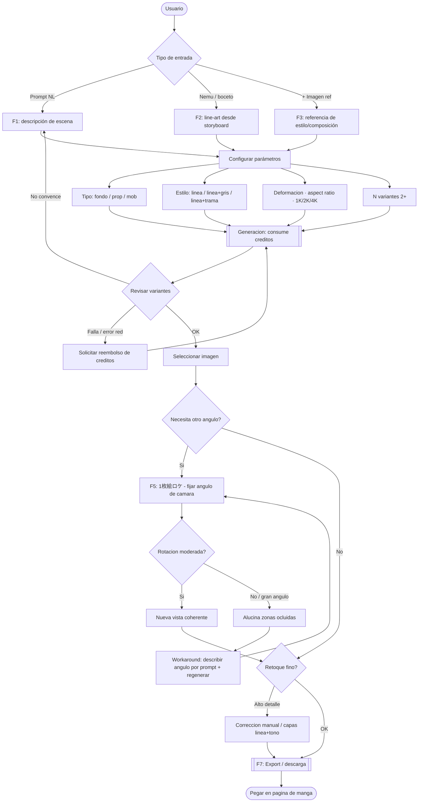

# 02 — Mapa funcional y UX de Ore-Ashi (俺アシ)

> Reconstrucción feature-por-feature del producto a partir de la superficie pública.
> Convención de rigor: `[VERIFICADO]` (con URL) · `[INFERIDO]` · `desconocido` (+ método).
> Base: `01-recon.md`. Fecha: 2026-07-24.

---

## 1. Modelo mental del producto

Ore-Ashi se presenta como **"un asistente de manga"**: el usuario da instrucciones en
lenguaje natural (como se las daría a un asistente humano) y la herramienta produce el
material de fondo/prop/mob en estilo de line-art de manga, listo para pegar en la página.
`[VERIFICADO]` [manual](https://note.com/mazinstudio/n/n6bb007e1a4b4).

Tres ejes definen cualquier operación:

1. **Qué generar** — tipo de objeto: 背景 (fondo) / 小物 (prop) / モブ (mob). `[VERIFICADO]`
2. **Con qué entrar** — prompt / nemu (ネーム) / boceto / imagen de referencia. `[VERIFICADO]`
3. **Cómo debe salir** — estilo (line / línea+gris / línea+trama), deformación, aspect
   ratio, resolución (1K/2K/4K), nº de variantes. `[VERIFICADO]`

Y una feature transversal sobre una imagen ya generada: **「1枚絵ロケ」** (rotar cámara).

---

## 2. Catálogo de features

### F1 — Generación por prompt (texto → material)
- **Input:** descripción en lenguaje natural. `[VERIFICADO]`
- **Salida:** line-art de fondo/prop/mob con perspectiva. `[VERIFICADO]`
- **Nota de calidad:** a mayor detalle en la descripción, mejor resultado. `[VERIFICADO]`
  [WebSearch note.com](https://note.com/mazinstudio/n/n6bb007e1a4b4).

### F2 — Generación desde nemu / boceto (ネーム → line-art)
- **Input:** boceto de página o rough. `[VERIFICADO]` [caso ①](https://note.com/mazinstudio/n/n37ff6755d668).
- **Valor:** evita reglas de perspectiva y entintado manual; ~70% menos tiempo; fondos de
  60–90 min → ~30 min. `[VERIFICADO]` [caso ①](https://note.com/mazinstudio/n/n37ff6755d668).
- **Consejo documentado:** cuidar el tamaño del nemu de entrada; salida 2K para más detalle;
  ajustar aspect ratio para evitar estirado horizontal. `[VERIFICADO]` [caso ②](https://note.com/mazinstudio/n/ne4c3fa56b295).

### F3 — Imagen de referencia (参照画像)
- **Input:** imagen que guía estilo/composición. `[VERIFICADO]`
- **Uso:** control adicional junto al prompt. `[VERIFICADO]`
- **Alcance exacto** (transferencia de estilo vs. de composición): `desconocido` — método:
  probar con cuenta propia y comparar salidas.

### F4 — Variantes múltiples
- **Comportamiento:** recomiendan generar **2+ imágenes a la vez** para comparar composición
  y detalle, y reducir retakes. `[VERIFICADO]` [/pricing](https://ore-ashi.com/pricing).
- **Coste:** cada variante consume créditos (consumo variable por calidad/feature). `[VERIFICADO]`

### F5 — 「1枚絵ロケ」 (Single Image Location) — rotación de cámara ★ feature clave
- **Input:** una imagen de fondo ya generada. `[VERIFICADO]`
- **Control:** ajustar el **ángulo de cámara** deseado. `[VERIFICADO]`
- **Salida:** la misma escena re-encuadrada desde el nuevo ángulo. `[VERIFICADO]`
- **Límites reconocidos por el fabricante:**
  - Rotación **moderada → buena**; rotación **grande → inventa zonas ocluidas**. `[VERIFICADO]`
  - Workaround: **describir el ángulo por prompt y regenerar**. `[VERIFICADO]`
  - Alto detalle → imperfecciones → **corrección manual**. `[VERIFICADO]`
- **Detalle de implementación (número de ángulos, si es continuo o por presets, si expone
  path de cámara):** `desconocido` — método: DevTools/observación con cuenta propia.

### F6 — Edición / corrección parcial
- **Estado:** el flujo real de edición fina (inpainting, retoque por regiones, máscaras)
  **no está confirmado** en la doc pública. `desconocido` — método: leer manual completo con
  sesión propia + observar la UI del editor.
- **Señal indirecta:** el manual sugiere superponer una capa de line-art en **modo multiplicar**
  sobre la salida gris para endurecer líneas → indica **capas separables** (line vs. tono).
  `[VERIFICADO]` [caso ②](https://note.com/mazinstudio/n/ne4c3fa56b295); `[INFERIDO]` que la
  salida puede exportarse/tratarse por capas.

### F7 — Export / descarga
- **Estado:** existe descarga del resultado (producto de pago que entrega imágenes). `[INFERIDO]`
- **Formatos exactos** (PNG plano vs. capas/PSD vs. transparencia): `desconocido` — método:
  DevTools al descargar con cuenta propia.

---

## 3. Parámetros de control (resumen tabular)

| Parámetro | Rol | Valores | Rigor |
|---|---|---|---|
| Tipo de objeto | qué se genera | 背景 / 小物 / モブ | `[VERIFICADO]` |
| Estilo de salida | acabado | 線画 / 線画＋グレー / 線画＋トーン | `[VERIFICADO]` |
| デフォルメ度 | nivel de deformación/estilización | escalar | `[VERIFICADO]` |
| アスペクト比 | encuadre | configurable | `[VERIFICADO]` |
| Resolución | detalle | 1K / 2K / 4K | `[VERIFICADO]` |
| Nº de variantes | exploración | 2+ recomendado | `[VERIFICADO]` |
| Imagen de referencia | guía visual | opcional | `[VERIFICADO]` |
| Ángulo de cámara | rotación (F5) | configurable | `[VERIFICADO]` |

---

## 4. Flujo completo (input → generación → edición → rotación → export)

> **Nota:** los nodos F6 (edición) y F7 (export) son parcialmente `[INFERIDO]`; el resto del
> flujo está `[VERIFICADO]` según §2. Las ramas de reembolso y de límite de rotación provienen
> de [/faq](https://ore-ashi.com/faq) y de la doc de note.com.

---

## 5. Modelo de negocio

| Elemento | Valor | Rigor |
|---|---|---|
| Unidad de cobro | **créditos** por operación | `[VERIFICADO]` [/pricing](https://ore-ashi.com/pricing) |
| Caducidad | sin caducidad | `[VERIFICADO]` |
| Consumo | **variable** según feature y calidad (1K/2K/4K) | `[VERIFICADO]` |
| Plan corporativo | ¥15,000/mes · 20,000 créditos · créditos compartidos · SMS MFA · audit logs · export | `[VERIFICADO]` |
| Planes individuales | starter/light + posible free trial | `desconocido` — método: `/pricing` con navegador propio |
| Créditos por operación | tabla exacta por feature×resolución | `desconocido` — método: DevTools al operar |
| Reembolso | ante fallo de generación/red, solicitud desde historial del job | `[VERIFICADO]` [/faq](https://ore-ashi.com/faq) |
| Derechos del output | del usuario; **uso comercial**; inputs fuera de entrenamiento por defecto | `[VERIFICADO]` [/faq](https://ore-ashi.com/faq) |

**Unidad económica `[INFERIDO]`:** el coste marginal real es GPU-segundo (ver `03`/`04`); los
créditos son una capa de precio sobre ese coste, escalando con resolución y con features caras
(la rotación 1枚絵ロケ y 4K son candidatas a mayor consumo). Confirmar tabla con cuenta propia.

---

## 6. Resumen ejecutivo de Fase 2

- El producto se organiza en **3 ejes** (qué generar / con qué entrar / cómo sale) más una
  **feature transversal de rotación de cámara (F5, 1枚絵ロケ)** sobre imágenes ya generadas.
- El **flujo canónico** es: entrada (prompt|nemu|ref) → parámetros → generación multi-variante
  (créditos) → selección → *(opcional)* rotación de cámara → *(opcional)* retoque → export.
- Puntos **verificados**: inputs, parámetros, límites de rotación, reembolso, derechos/uso
  comercial. Puntos **desconocidos con método**: editor de retoque fino, formatos de export,
  tabla exacta de créditos, detalle interno de la rotación.
- La **rama F5** concentra el riesgo técnico del proyecto y es la que se deconstruye en la
  siguiente fase.

**Siguiente fase:** `03-pipeline-3d.md` — deconstrucción técnica de "imagen → mundo 3D",
comparación de familias de solución y recomendación self-host.
