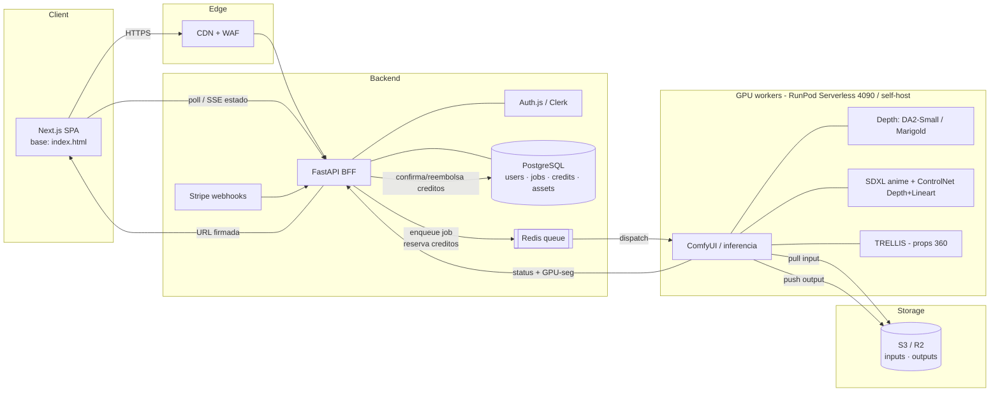
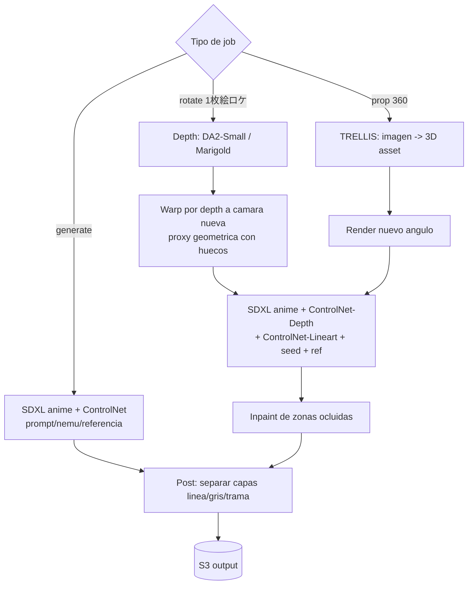

# 04 — Arquitectura replicable (MI sistema, no el de Ore-Ashi)

> Diseño de **Fondo-manga**: mi propia app de generación de fondos/props/mobs + rotación
> de cámara (1枚絵ロケ), **self-host GPU**, tecnología abierta y licencia comercial.
> No copia el stack de Ore-Ashi (desconocido, ver `01 §8`); toma de él solo el *qué/cómo*
> conceptual (`02`) y adopta el pipeline recomendado en `03` (Familia C "Fake-3D").
>
> Rigor: `[VERIFICADO]` (dato externo con URL) · `[DECISIÓN]` (elección de diseño mía) ·
> `[INFERIDO]` · `desconocido`. Fecha: 2026-07-24.

---

## 1. Principios de diseño

- **Una sola pila de inferencia** para generación (F1/F2) y rotación (F5): mismo modelo de
  estilo line-art, distinto condicionamiento. `[DECISIÓN]` (justificado en `03 §3`).
- **Jobs asíncronos con créditos**: toda operación GPU es un *job* encolado; los créditos se
  reservan al encolar y se confirman/reembolsan al terminar. `[DECISIÓN]`
- **GPU stateless y escalable a cero**: los workers no guardan estado; el estado vive en
  Postgres + object storage. Permite RunPod Serverless (scale-to-zero) en prod. `[DECISIÓN]`
- **Storage S3-compatible** para inputs/outputs; la BD solo guarda metadatos y punteros.
- **Licencias limpias** en todo el pipeline (Apache/MIT/open, ver `03`). `[DECISIÓN]`

---

## 2. Stack

| Capa | Elección | Por qué | Rigor |
|---|---|---|---|
| Front | **Next.js (React) + Tailwind**, partiendo del `index.html` actual como base visual | ya existe un prototipo de UI "papel de manga" reutilizable (`/index.html`) | `[DECISIÓN]` / `[VERIFICADO]` (repo) |
| API / BFF | **FastAPI (Python)** | mismo lenguaje que la inferencia; Pydantic da JSON schemas gratis | `[DECISIÓN]` |
| Auth | **Auth.js / Clerk** (email + OAuth); MFA opcional | estándar; Ore-Ashi ofrece SMS MFA en plan corp (`01 §5`) | `[DECISIÓN]` / `[VERIFICADO]` |
| Base de datos | **PostgreSQL** (usuarios, jobs, ledger de créditos, assets) | transaccional para el ledger | `[DECISIÓN]` |
| Cola de jobs | **Redis + RQ/Celery** (o cola nativa de RunPod Serverless) | desacopla API de GPU; reintentos | `[DECISIÓN]` |
| Workers GPU | **ComfyUI headless** o servidor de inferencia propio (FastAPI) en contenedor | orquesta Depth + ControlNet + SDXL + TRELLIS con grafos reproducibles | `[DECISIÓN]` |
| Object storage | **S3-compatible** (Cloudflare R2 / MinIO self-host) | barato, URLs firmadas | `[DECISIÓN]` |
| Pagos | **Stripe** (compra de paquetes de créditos) | estándar; créditos sin caducidad como Ore-Ashi | `[DECISIÓN]` / `[VERIFICADO]` |
| Observabilidad | logs estructurados + métricas de GPU-segundo por job | necesario para el costeo real (§6) | `[DECISIÓN]` |

**Modelos en los workers (de `03`):** Depth Anything V2-Small / Marigold (Apache); SDXL/
Illustrious anime + ControlNet-Depth + ControlNet-Lineart (open); TRELLIS (MIT) para props.

---

## 3. Diagrama de arquitectura



---

## 4. Contratos de API (endpoints + JSON schemas)

> Convención: REST + JSON. Todas las operaciones GPU devuelven un **job** y se consultan por
> polling o SSE. Los `credit_cost` son estimados (ver §6) — **la tabla exacta se calibra con el
> spike** (`05`). Nada de esto imita endpoints de Ore-Ashi (desconocidos); son **de diseño propio**.

### 4.1 `POST /api/v1/generate` — generación (F1/F2/F3)
Request:
```json
{
  "type": "background | prop | mob",
  "input": {
    "prompt": "string",
    "nemu_image_id": "string | null",
    "reference_image_id": "string | null"
  },
  "style": "line | line_gray | line_tone",
  "deformation": 0.0,
  "aspect_ratio": "16:9 | 4:3 | 1:1 | 3:4 | custom",
  "resolution": "1k | 2k | 4k",
  "variants": 2,
  "seed": 123456
}
```
Response `202 Accepted`:
```json
{
  "job_id": "job_abc123",
  "status": "queued",
  "estimated_credits": 8,
  "variants": 2,
  "poll_url": "/api/v1/jobs/job_abc123"
}
```

### 4.2 `POST /api/v1/rotate` — 1枚絵ロケ (F5)
Request:
```json
{
  "source_asset_id": "asset_xyz789",
  "camera": {
    "yaw_deg": -25,
    "pitch_deg": 10,
    "dolly": 0.0
  },
  "angle_prompt": "string | null",
  "style": "line | line_gray | line_tone",
  "seed": 123456,
  "keep_reference": true
}
```
Response `202 Accepted`:
```json
{
  "job_id": "job_rot456",
  "status": "queued",
  "estimated_credits": 12,
  "warning": "yaw>30deg puede alucinar zonas ocluidas; usa angle_prompt",
  "poll_url": "/api/v1/jobs/job_rot456"
}
```

### 4.3 `GET /api/v1/jobs/{job_id}` — estado del job
Response:
```json
{
  "job_id": "job_rot456",
  "status": "queued | running | succeeded | failed",
  "progress": 0.65,
  "gpu_seconds": 28.4,
  "credits_charged": 12,
  "results": [
    { "asset_id": "asset_new01", "url": "https://.../signed", "layers": ["line","tone"] }
  ],
  "error": null
}
```

### 4.4 Otros
- `POST /api/v1/assets/{id}/export` → `{ "format": "png | psd | layered_zip", "transparent": true }`
  (formatos internos de exportación **de diseño propio**; los de Ore-Ashi son `desconocido`).
- `POST /api/v1/uploads` → devuelve `image_id` + URL firmada de subida (nemu/referencia).
- `GET /api/v1/credits` → `{ "balance": 1520, "ledger_url": "..." }`.
- `POST /api/v1/jobs/{id}/refund` → reembolso ante fallo (espejo del comportamiento de Ore-Ashi,
  `01 §5`) `[VERIFICADO]` [/faq](https://ore-ashi.com/faq).
- Webhooks Stripe → acreditan paquetes de créditos comprados.

### 4.5 Modelo de datos (mínimo)
```
users(id, email, plan, mfa_enabled, created_at)
credits_ledger(id, user_id, delta, reason, job_id, balance_after, created_at)
jobs(id, user_id, type, params_json, status, gpu_seconds, credits_charged, created_at)
assets(id, user_id, job_id, s3_key, style, layers_json, parent_asset_id, created_at)
```
`parent_asset_id` enlaza una rotación con su imagen fuente (linaje de 1枚絵ロケ). `[DECISIÓN]`

---

## 5. Pipeline de inferencia (dónde corre cada modelo)



- Todos los modelos caben en **24 GB** (ver `03 §2`); un worker = 1 GPU. `[VERIFICADO]`/`[INFERIDO]`
- El grafo de rotación **reutiliza** el nodo de re-estilización (`R3`/`G2`) del de generación →
  una sola pila. `[DECISIÓN]`

---

## 6. Estimación de costo por operación

Base de GPU (de la investigación de Fase 4 del plan, verificada jul-2026):
- **RunPod Serverless RTX 4090 ≈ $1.10/hr activo, $0 idle** (facturación por segundo). `[VERIFICADO]`
  → **$0.000306 por GPU-segundo**.

| Operación | GPU-seg estimados | Coste GPU `[INFERIDO]` | Notas |
|---|---|---|---|
| Generación 1 variante 1K | ~6–10 s | **$0.002–0.003** | 1 pasada de difusión |
| Generación 1 variante 2K | ~12–20 s | **$0.004–0.006** | recomendado para fondos |
| Generación 1 variante 4K | ~25–45 s | **$0.008–0.014** | upscale/tiling |
| Rotación 1枚絵ロケ (moderada) | ~20–40 s | **$0.006–0.012** | depth + warp + difusión + inpaint |
| Rotación (gran ángulo, +inpaint) | ~35–60 s | **$0.011–0.018** | más des-oclusión |
| Prop 360 (TRELLIS) | ~30–60 s | **$0.009–0.018** | + render + re-estilizado |

> **Todos los costes son `[INFERIDO]`**: las latencias reales se miden en el **spike** (`05`) y
> reemplazan estas estimaciones. A esto hay que sumar overhead fijo (API, storage, egress) y el
> margen para fijar el **precio en créditos** (la capa de negocio va por encima del coste GPU).

**Unidad de negocio:** 1 crédito ≈ coste-GPU-de-una-generación-1K × margen. La rotación y el 4K
consumen más créditos por su mayor GPU-tiempo (coincide con "consumo variable por calidad/feature"
observado en Ore-Ashi, `01 §5`). `[DECISIÓN]` alineada con `[VERIFICADO]`.

---

## 7. Escalado y despliegue

- **Dev/spike:** 1× RTX 4090 on-demand (Vast.ai ~$0.29–0.59/hr o TensorDock ~$0.25/hr). `[VERIFICADO]`
- **Prod:** RunPod Serverless 4090 con scale-to-zero; N workers según cola. `[VERIFICADO]`
- **Picos/48GB+:** reservar A100 80GB solo si el spike mide que algo no cabe en 24 GB. `[VERIFICADO]`
- **CDN + URLs firmadas** para servir outputs sin pasar por la API.

---

## 8. Resumen ejecutivo de Fase 4

- Sistema **self-host, asíncrono y con créditos**: Next.js (sobre el `index.html` existente) →
  FastAPI → Redis queue → workers GPU (ComfyUI) → Postgres + S3.
- **Una sola pila de inferencia** implementa `03`: generación y rotación comparten el
  re-estilizador line-art; depth+warp+ControlNet+inpaint para 1枚絵ロケ; TRELLIS para props.
- **Contratos de API propios** (`/generate`, `/rotate`, `/jobs`, `/export`, `/credits`, refund),
  con JSON schemas y modelo de datos que registra el **linaje de rotaciones** (`parent_asset_id`).
- **Costo estimado** por render: **~$0.002–0.006** (generación) y **~$0.006–0.018** (rotación) en
  4090 serverless — **`[INFERIDO]`, a calibrar en el spike**.

**Siguiente fase:** `05-mvp.md` — recorte al mínimo (1 imagen → rotar cámara → line-art coherente),
backlog priorizado, hitos y el primer spike técnico de esta semana.
